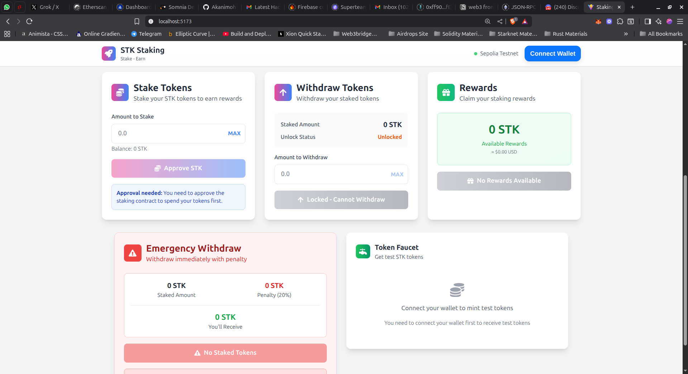

# STK Staking DApp Frontend

A modern, responsive React application for interacting with the STK staking smart contracts on Ethereum Sepolia testnet.

## 🚀 Features

### Core Functionality
- **Wallet Connection**: Connect with MetaMask, WalletConnect, and other popular wallets
- **Real-time Updates**: Live contract data with automatic refresh every 10 seconds
- **Staking**: Stake STK tokens with automatic approval handling
- **Withdrawals**: Withdraw staked tokens after lock period
- **Rewards**: Claim accumulated staking rewards
- **Emergency Withdraw**: Emergency withdrawal option with penalty

### User Interface



### Dashboard Features
- **Portfolio Overview**: Complete view of user's staking position
- **Statistics Cards**: Real-time protocol and user statistics
- **Transaction History**: Event-based transaction tracking
- **APR Display**: Current and dynamic APR rates
- **Lock Timer**: Countdown timer for withdrawal availability

## 🛠️ Technology Stack

- **React 18** - Modern React with hooks
- **TypeScript** - Type-safe development
- **Vite** - Fast build tool and dev server
- **Tailwind CSS** - Utility-first CSS framework
- **Viem** - Ethereum library for contract interactions
- **Wagmi** - React hooks for Ethereum
- **RainbowKit** - Wallet connection UI
- **React Hot Toast** - Elegant notifications
- **React Icons** - Icon library

## 📱 Contract Integration

### Deployed Contracts (Sepolia)
- **STK Token**: `0x7c37ca51E4e649A620E0BF2Fc67Fe5f57E6AB117`
- **Staking Contract**: `0x37c9a4d8193A2F67C7eDa8a18136E9856cE4010a`

## Live Link
https://stakingdapp-by-akanimoh.vercel.app/


## 🚀 Getting Started

### Prerequisites
- Node.js 18+ 
- npm or yarn
- MetaMask or compatible wallet
- Sepolia ETH for transactions

### Installation
```bash
# Install dependencies
npm install

# Start development server
npm run dev

# Build for production
npm run build
```

### Usage
1. Connect your wallet to Sepolia testnet
2. Get some STK tokens (contact owner to mint)
3. Approve and stake your tokens
4. Monitor rewards and withdraw when ready

## 📊 Contract Configuration

- **Initial APR**: 10% (decreases with total staked)
- **Lock Duration**: 1 day minimum
- **Emergency Penalty**: 20% of staked amount
- **Network**: Ethereum Sepolia (Chain ID: 11155111)

---

**Built with ❤️ for the STK Staking Protocol**
